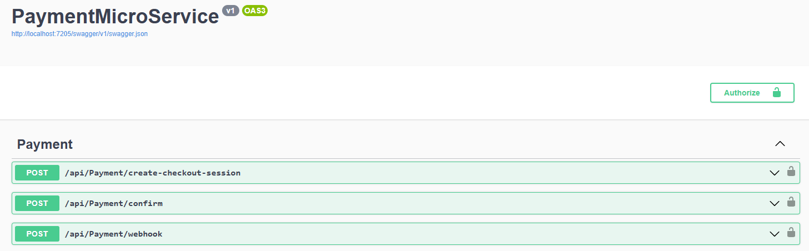
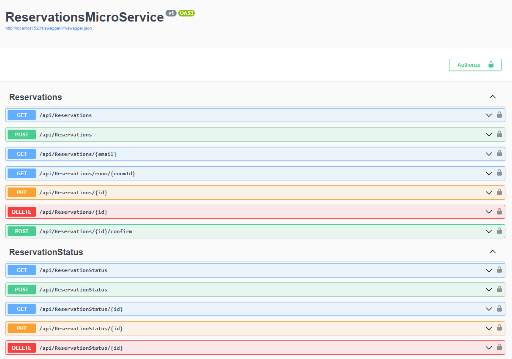
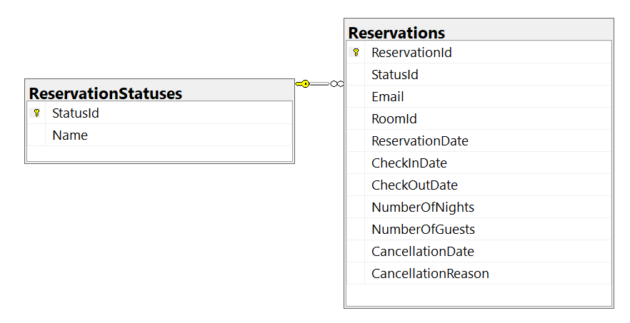
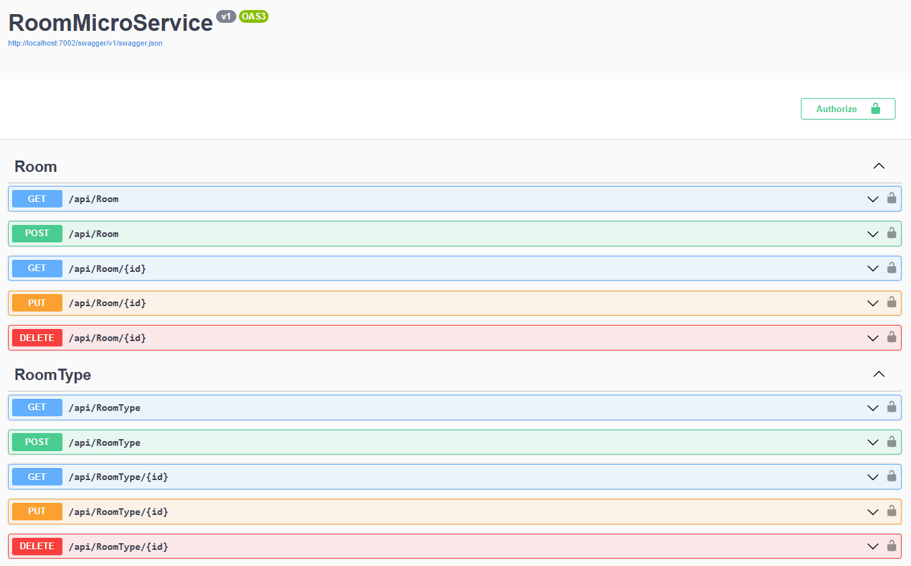
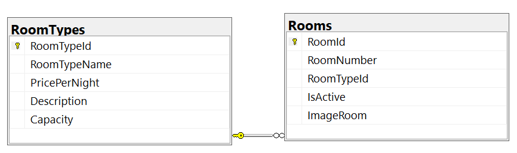
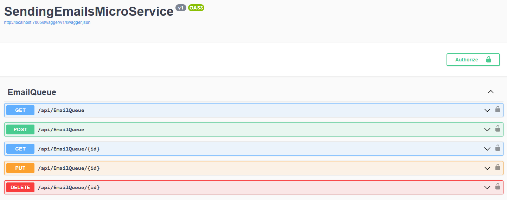
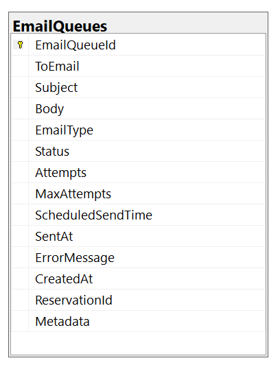
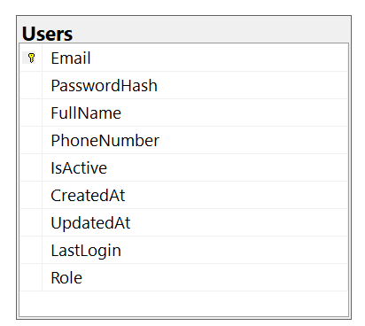

# RoomReservationMicroServicesApiNet

This project is a microservices API for a room booking system, developed in .NET. It allows you to manage rooms, room types, bookings, payments with Stripe, email notifications, and user and authorization management.

## Features

- **Room Management**: Create, update, delete, and query rooms and room types.

- **Bookings**: Create, manage, and cancel room bookings.

- **Payments**: Integration with Stripe to process booking payments.

- **Email Notifications**: Service for sending confirmation emails and notifications.

- **User and Authorization Management**: User authentication and authorization with JWT.

- **Microservices Architecture**: Each functionality is separated into independent microservices.

- **Multiple Databases**: Support for SQL Server, MySQL, PostgreSQL, SQLite, and MongoDB.

- **API Documentation**: Swagger for interactive API documentation.

## Technologies Used

- **Framework**: .NET 8.0
- **ASP.NET Core**: For building REST APIs.

- **Entity Framework Core**: For data access and ORM.

- **JWT (JSON Web Tokens)**: For authentication and authorization.

- **Stripe**: For payment processing.

- **MongoDB Driver**: For MongoDB support.

- **Swashbuckle (Swagger)**: For API documentation.

- **Database Providers**:

- Microsoft.EntityFrameworkCore.SqlServer

- Pomelo.EntityFrameworkCore.MySQL

- Npgsql.EntityFrameworkCore.PostgreSQL

- Microsoft.EntityFrameworkCore.Sqlite

- MongoDB.Driver

## Requirements

- **.NET SDK 8.0** or higher.

- **Database**: One of the following:

- SQL Server

- MySQL

- PostgreSQL

- SQLite

- MongoDB

- **Stripe Account**: For processing payments (configure keys in appsettings.json).

- **Mail Server**: For sending emails (configure in appsettings.json).

## Installation

1. Clone the repository:
   ```
   git clone <url-del-repositorio>
   cd RoomReservationMicroServicesApiNet
   ```

2. Configure the databases and external services in the `appsettings.json` files of each microservice:

- Configure the connection strings for the chosen database.

- Configure the JWT keys.

- Configure the Stripe keys.

- Configure the email settings (SMTP, etc.).

3. Restore the dependencies:
   ```
   dotnet restore
   ```

4. Run the database migrations for each microservice (if you are using EF Core):
   ```
   cd <MicroServiceDirectory>
   dotnet ef database update
   ```

## Execution

To run all the microservices, use the provided script:

```
./start-services.sh
```

Or run each microservice individually:

1. **PaymentMicroService** (port 5177):
   ```
   cd PaymentMicroService
   dotnet run
   ```

2. **ReservationsMicroService** (port 7216):
   ```
   cd ReservationsMicroService
   dotnet run
   ```

3. **RoomMicroService** (port 7002):
   ```
   cd RoomMicroService
   dotnet run
   ```

4. **SendingEmailsMicroService** (port 7005):
   ```
   cd SendingEmailsMicroService
   dotnet run
   ```

5. **UserAndAuthorizationManagementMicroService** (port 7007):
   ```
   cd UserAndAuthorizationManagementMicroService
   dotnet run
   ```

Access the Swagger documentation at `http://localhost:<port>/swagger` for each microservice.

## Microservices and Endpoints

### PaymentMicroService (port 5177)
Manages payments with Stripe.

- **POST /api/payment/create-checkout-session** (Authorized): Creates a Stripe checkout session for a reservation.

- **POST /api/payment/confirm**: Confirms payment after a successful checkout.

- **POST /api/payment/webhook**: Endpoint for Stripe webhooks for payment events.

### ReservationsMicroService (port 7216)
Manages room reservations.

- **GET /api/reservations**: Retrieves all reservations (Authorized).

- **GET /api/reservations/{id}**: Retrieves a reservation by ID (Authorized).

- **POST /api/reservations**: Creates a new reservation (Authorized).

- **PUT /api/reservations/{id}**: Updates a reservation (authorized).

- **DELETE /api/reservations/{id}**: Deletes a reservation (authorized).

- **GET /api/reservationstatus**: Gets all reservation statuses (authorized).

- **POST /api/reservationstatus**: Creates a new reservation status (authorized).

- **PUT /api/reservationstatus/{id}**: Updates a reservation status (authorized).

- **DELETE /api/reservationstatus/{id}**: Deletes a reservation status (authorized).

### RoomMicroService (port 7002)
Manages rooms and room types.

- **GET /api/room**: Gets all rooms (authorized).

- **GET /api/room/{id}**: Gets a room by ID (authorized).

- **POST /api/room**: Creates a new room (authorized).

- **PUT /api/room/{id}**: Updates a room (authorized).

- **DELETE /api/room/{id}**: Deletes a room (authorized).

- **GET /api/roomtype**: Gets all room types (authorized).

- **GET /api/roomtype/{id}**: Gets a room type by ID (authorized).

- **POST /api/roomtype**: Creates a new room type (authorized).

- **PUT /api/roomtype/{id}**: Updates a room type (authorized).

- **DELETE /api/roomtype/{id}**: Deletes a room type (authorized).

### SendingEmailsMicroService (port 7005)
Manages sending emails.

- **POST /api/email/send**: Sends an email (authorized).

### UserAndAuthorizationManagementMicroService (port 7007)
Manages users and authorizations.

- **POST /api/auth/login**: Logs a user in.

- **POST /api/auth/register**: Registers a new user.

- **GET /api/users**: Gets all users (authorized, admin).

- **GET /api/users/{id}**: Gets a user by ID (authorized).

- **PUT /api/users/{id}**: Updates a user (authorized).

- **DELETE /api/users/{id}**: Deletes a user (authorized, admin).


## PaymentMicroService

PaymentMicroService/  
├── Controllers/  
│   └── PaymentController.cs  
├── DTOs/  
│   ├── CheckoutSessionResponseDTO.cs  
│   ├── CreateCheckoutSessionDTO.cs  
│   └── UserDTO.cs  
├── Middleware/  
│   └── ErrorHandlingMiddleware.cs  
├── Models/  
│   ├── Reservation.cs  
│   └── StripeSettings.cs  
├── Services/  
│   ├── EmailServiceClient.cs  
│   ├── IStripeService.cs  
│   ├── ReservationServiceClient.cs  
│   ├── StripeService.cs  
│   └── UserServiceClient.cs  
├── appsettings.json  
└── Program.cs  

<kbd>
  
</kbd>  

## ReservationsMicroService

ReservationsMicroService/  
├── Controllers/  
│   ├── ReservationsController.cs  
│   └── ReservationStatusController.cs  
├── Data/  
│   └── ReservationsDbContext.cs  
├── DTOs/  
│   ├── CreateReservationDTO.cs  
│   ├── CreateReservationStatusDTO.cs  
│   ├── ReservationDTO.cs  
│   ├── ReservationStatusDTO.cs  
│   ├── RoomDTO.cs  
│   ├── UpdateReservationStatusDTO.cs  
│   └── UserDTO.cs  
├── Helpers/   
│   └── ReservationHelpers.cs  
├── Middleware/  
│   └── ErrorHandlingMiddleware.cs  
├── Models/  
│   ├── DatabaseSettings.cs  
│   ├── Reservation.cs  
│   ├── ReservationStatus.cs  
│   └── Room.cs  
├── Repository/  
│   ├── IReservationRepository.cs  
│   ├── IReservationStatusRepository.cs  
│   ├── ReservationRepository.cs  
│   └── ReservationStatusRepository.cs  
├── Services/  
│   ├── EmailServiceClient.cs  
│   ├── IReservationService.cs  
│   ├── IReservationStatusService.cs  
│   ├── ReservationService.cs  
│   ├── ReservationStatusService.cs  
│   ├── RoomServiceClient.cs  
│   └── UserServiceClient.cs  
├── appsettings.json  
└── Program.cs  

<kbd>
  
</kbd>  

### ReservationsDB
- **Reservations**: 
- ReservationId (int, PK) 
-StatusId(int,FK) 
- Email (string, required) 
-RoomId(int) 
- ReservationDate (DateTime) 
- CheckInDate (DateTime, required) 
- CheckOutDate (DateTime, required) 
- NumberOfNights (int, required) 
- NumberOfGuests (int, required) 
- CancellationDate (DateTime?) 
- CancellationReason (string)

- **ReservationStatus**: 
-StatusId(int,PK) 
- Name (string, required, max 50)

<kbd>
  
</kbd>  

## RoomMicroService

RoomMicroService/  
├── Controllers/  
│   ├── RoomController.cs  
│   └── RoomTypeController.cs  
├── Data/  
│   └── RoomDbContext.cs  
├── DTOs/  
│   ├── CreateRoomDTO.cs  
│   ├── CreateRoomTypeDTO.cs  
│   ├── RoomDTO.cs  
│   ├── RoomTypeDTO.cs  
│   ├── UpdateRoomDTO.cs  
│   └── UpdateRoomTypeDTO.cs  
├── Middleware/  
│   └── ErrorHandlingMiddleware.cs  
├── Models/  
│   ├── DatabaseSettings.cs  
│   ├── Room.cs  
│   └── RoomType.cs  
├── Repository/  
│   ├── IRoomRepository.cs    
│   ├── IRoomTypeRepository.cs  
│   ├── RoomRepository.cs  
│   └── RoomTypeRepository.cs  
├── Services/  
│   ├── IRoomService.cs  
│   ├── IRoomTypeService.cs  
│   ├── RoomService.cs  
│   └── RoomTypeService.cs  
├── appsettings.json  
└── Program.cs  

<kbd>
  
</kbd>  

### RoomDB
- **Rooms**: 
-RoomId(int,PK) 
- RoomNumber (string, required, max 10) 
- RoomTypeId (int, FK) 
-IsActive(bool, default true) 
- ImageRoom (string?)

- **RoomTypes**: 
- RoomTypeId (int, PK) 
- RoomTypeName (string, required, max 100) 
- PricePerNight (decimal, required) 
- Description (string, max 500) 
- Capacity (int, default 2)

<kbd>
  
</kbd>  

## SendingEmailsMicroService

SendingEmailsMicroService/  
├── Controllers/  
│   └── EmailQueueController.cs  
├── Data/  
│   └── SendingEmailsDbContext.cs  
├── DTOs/  
│   ├── CreateEmailQueueDTO.cs  
│   ├── EmailQueueDTO.cs  
│   └── UpdateEmailQueueDTO.cs  
├── Helpers/   
│   └── EmailQueueHelpers.cs  
├── Middleware/  
│   └── ErrorHandlingMiddleware.cs  
├── Models/  
│   ├── DatabaseSettings.cs   
│   └── EmailQueue.cs  
├── Services/  
│   ├── EmailQueueService.cs    
│   ├── EmailService.cs  
│   ├── EmailWorker.cs  
│   └── IEmailQueueService.cs  
├── appsettings.json  
└── Program.cs  

<kbd>
  
</kbd>  

### SendingEmailsDB
- **EmailQueues** 
- EmailQueueId (int, PK)
- Email (string, required)
- Subject (string, required)
- Body (string, required)
- Status (string, required, default "Pending")
- CreatedAt (DateTime, required, default DateTime.UtcNow)

<kbd>
  
</kbd>  

## UserAndAuthorizationManagementMicroService

UserAndAuthorizationManagementMicroService/  
├── Controllers/  
│   ├── AuthController.cs  
│   └── UsersController.cs  
├── Data/  
│   └── UserAndAuthorizationManagementDbContext.cs  
├── DTOs/  
│   ├── CreateUserDTO.cs  
│   ├── LoginRequestDTO.cs  
│   ├── LoginResponseDTO.cs  
│   ├── RegisterRequestDTO.cs  
│   ├── UpdateUserDTO.cs  
│   └── UserDTO.cs  
├── Helpers/  
│   └── AuthHelpers.cs  
├── Middleware/  
│   └── ErrorHandlingMiddleware.cs  
├── Models/  
│   ├── DatabaseSettings.cs  
│   └── User.cs  
├── Repository/  
│   ├── IUserRepository.cs  
│   └── UserRepository.cs  
├── Services/  
│   ├── AuthService.cs  
│   ├── IUserService.cs  
│   └── UserService.cs  
├── appsettings.json  
└── Program.cs  

<kbd>
  
</kbd>  

### UserAndAuthorizationManagementDB
- **Users**: 
-UserId(int,PK) 
- Email (string, required) 
- PasswordHash (string, required) 
- Role (string, required) 
- etc.

<kbd>
  
</kbd>  

[DeepWiki moraisLuismNet/RoomReservationMicroServicesApiNet](https://deepwiki.com/moraisLuismNet/RoomReservationMicroServicesApiNet)